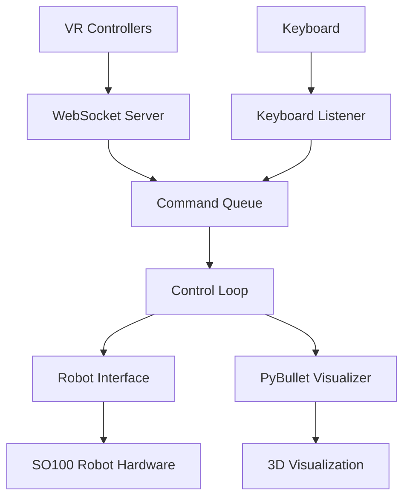

# SO100 Robot Teleoperation System

A consolidated teleoperation control system for the SO100 robot that supports multiple input methods (VR controllers, keyboard, phone support coming...) with shared inverse kinematics and 3D visualization.


*VR controller interface showing how to control the robot arms using grip and trigger buttons*

## Features

- **Unified Architecture**: Single entry point that coordinates all components
- **Multiple Input Methods**: VR controllers (Quest/WebXR) and keyboard control
- **Shared IK/FK Logic**: PyBullet-based inverse and forward kinematics for both arms
- **Real-time Visualization**: 3D PyBullet visualization with coordinate frames and markers
- **Safety Features**: Joint limit clamping, graceful shutdown, and error handling
- **Async/Non-blocking**: All components run concurrently without blocking

## Installation

### Prerequisites

1. **Robot Hardware**: One or two SO100 arm robot with USB-serial connections
2. **Python Environment**: Python 3.8+ with required packages
3. **VR Setup** (optional): Meta Quest or other headset with WebXR support


### Package Installation

You must first manually install LeRobot according to the official instructions at [https://github.com/huggingface/lerobot](https://github.com/huggingface/lerobot).

Follow the official LeRobot installation guide:

```bash
# Clone the official LeRobot repository
git clone https://github.com/huggingface/lerobot.git
cd lerobot

# Install according to their instructions (typically):
pip install -e .
```

After installing LeRobot, install this teleoperation package:

```bash
# Install in editable mode (recommended for development)
pip install -e .

# Or install basic requirements manually
pip install -r requirements.txt
```

### Dependencies

Required packages include:
- `lerobot` - Robot control library (install manually first!)
- `pybullet` - Physics simulation and IK/FK
- `websockets` - WebSocket server for VR
- `pynput` - Keyboard input handling
- `scipy` - Spatial transformations
- `numpy`, `torch` - Numerical computing

### SSL Certificates (Auto-Generated)

The system will automatically create self-signed SSL certificates (`cert.pem` and `key.pem`) if they don't exist. No manual setup required!

If you need to generate them manually for any reason:

```bash
openssl req -x509 -newkey rsa:2048 -keyout key.pem -out cert.pem -sha256 -days 365 -nodes -subj "/C=US/ST=Test/L=Test/O=Test/OU=Test/CN=localhost"
```

## Usage

### Basic Usage

Run the complete teleoperation system:

```bash
python -m teleop
```

This starts:
- HTTPS server for web interface (default port 8443)
- WebSocket server for VR controllers (default port 8442)
- Keyboard input listener
- Robot interface and control loop
- PyBullet 3D visualization

### Command Line Options

```bash
python -m teleop [OPTIONS]

Options:
  --no-robot        Disable robot connection (visualization only)
  --no-viz          Disable PyBullet visualization  
  --no-vr           Disable VR WebSocket server
  --no-keyboard     Disable keyboard input
  --https-port PORT HTTPS server port (default: 8443)
  --ws-port PORT    WebSocket server port (default: 8442)
  --host HOST       Host IP address (default: 0.0.0.0)
  --urdf PATH       Path to robot URDF file
  --left-port PORT  Left arm serial port (default: /dev/ttySO100red)
  --right-port PORT Right arm serial port (default: /dev/ttySO100leader)
```

### Development/Testing Modes

**Visualization Only** (no robot hardware):
```bash
python -m teleop --no-robot
```

**Keyboard Only** (no VR):
```bash
python -m teleop --no-vr
```

**Headless** (no PyBullet GUI):
```bash
python -m teleop --no-viz
```

## Control Methods

### VR Controller Control

1. **Setup**: Connect Meta Quest to same network, navigate to `https://<robot-ip>:8443`

2. **Arm Position Control**: 
   - **Hold grip button** to activate position control for that arm
   - While holding grip, the robot arm gripper tip will track your controller position in 3D space
   - Release grip button to deactivate position control

3. **Wrist Orientation Control**:
   - The **roll and pitch** of your controller will be matched on the wrist joint of the arm
   - This allows precise orientation control of the end effector

4. **Gripper Control**:
   - Press and **hold trigger button** to close the gripper
   - The gripper stays closed as long as you hold the trigger
   - Release trigger to open the gripper

5. **Independent Control**: Left and right controllers control their respective robot arms independently - you can operate both arms simultaneously or one at a time

### Keyboard Control

1. **Left Arm Control**:
   - **W/S**: Forward/Backward
   - **A/D**: Left/Right 
   - **Q/E**: Down/Up
   - **Z/X**: Wrist roll
   - **F**: Toggle gripper open/closed
   - **Tab**: Manual toggle position control on/off

2. **Right Arm Control**:
   - **I/K**: Forward/Backward
   - **J/L**: Left/Right
   - **U/O**: Up/Down
   - **N/M**: Wrist roll
   - **; (semicolon)**: Toggle gripper open/closed
   - **Enter**: Manual toggle position control on/off

3. **Auto-Activation**: Position control is automatically activated when you press movement keys. Tab/Enter are only needed for manual toggle.

4. **Exit**: **ESC** to stop the system

## Architecture

### Directory Structure

```
teleop/                     # Main Python package
├── __init__.py            # Package initialization
├── __main__.py            # Module entry point
├── main.py                # Main system coordinator
├── config.py              # Configuration and constants
├── control_loop.py        # Main control loop
├── core/                  # Core robot functionality
│   ├── robot_interface.py # Robot control wrapper
│   ├── kinematics.py      # IK/FK utilities
│   └── visualizer.py      # PyBullet visualization
└── inputs/                # Input providers
    ├── base.py            # Base classes and data structures
    ├── vr_ws_server.py    # VR WebSocket server
    └── keyboard_listener.py # Keyboard input handler

webapp/                    # Web application files
├── index.html            # VR interface HTML
└── app.js                # VR controller JavaScript
```

### Component Communication



### Control Flow

1. **Input Providers** (VR/Keyboard) generate `ControlGoal` messages
2. **Command Queue** buffers goals for processing
3. **Control Loop** consumes goals and executes them:
   - Converts position goals to IK solutions
   - Updates robot arm angles with safety clamping
   - Sends commands to robot hardware
   - Updates 3D visualization
4. **Robot Interface** manages hardware communication and safety

### Data Structures

**ControlGoal**: High-level control command
```python
@dataclass
class ControlGoal:
    arm: Literal["left", "right"]           # Target arm
    mode: ControlMode                       # POSITION_CONTROL or IDLE
    target_position: Optional[np.ndarray]   # 3D position (robot coordinates)
    wrist_roll_deg: Optional[float]         # Wrist roll angle
    gripper_closed: Optional[bool]          # Gripper state
    metadata: Optional[Dict]                # Additional data
```

## Configuration

### Robot Configuration

- **Joint Names**: `["shoulder_pan", "shoulder_lift", "elbow_flex", "wrist_flex", "wrist_roll", "gripper"]`
- **IK Joints**: First 3 joints used for position control
- **Direct Control**: Wrist roll and gripper controlled directly
- **Safety**: Joint limits read from URDF and enforced

### Network Configuration

- **HTTPS Port**: 8443 (web interface)
- **WebSocket Port**: 8442 (VR controllers)  
- **Host**: 0.0.0.0 (all interfaces)

### Coordinate Systems

- **VR**: X=right, Y=up, Z=back (toward user)
- **Robot**: X=forward, Y=left, Z=up
- **Transformation**: Handled automatically in kinematics module

## Troubleshooting

### Common Issues

**Robot Connection Failed**:
- Check USB-serial device permissions: `sudo chmod 666 /dev/ttySO100*`
- Verify port names match actual devices
- Try running with `--no-robot` for testing

**VR Controllers Not Connecting**:
- Ensure Quest and robot are on same network
- SSL certificates are generated automatically, but check `cert.pem` and `key.pem` exist if issues persist
- Try accessing web interface directly in browser first
- If OpenSSL is missing, install it: `sudo apt-get install openssl` (Ubuntu) or `brew install openssl` (macOS)

**PyBullet Visualization Issues**:
- Install PyBullet: `pip install pybullet`
- Try headless mode: `--no-viz`
- Check URDF file exists at specified path

**Keyboard Input Not Working**:
- Run with appropriate permissions for input access
- Check terminal has focus for key events
- Try `--no-keyboard` to isolate issue

### Debug Modes

**Verbose Logging**:
```python
import logging
logging.basicConfig(level=logging.DEBUG)
```

**Component Isolation**:
- Test individual components with disable flags
- Check component status in logs
- Verify queue communication

## Development

### Adding New Input Methods

1. Create new input provider inheriting from `BaseInputProvider`
2. Implement `start()`, `stop()`, and command generation
3. Add to `TeleopSystem` initialization
4. Configure via command line arguments

### Extending Robot Interface

1. Add new methods to `RobotInterface`
2. Update `ControlGoal` data structure if needed
3. Modify control loop execution logic
4. Test with `--no-robot` mode first

### Custom Visualization

1. Extend `PyBulletVisualizer` class
2. Add new marker types or coordinate frames
3. Update visualization calls in control loop

## Safety Notes

- **Emergency Stop**: Press Ctrl+C for graceful shutdown
- **Joint Limits**: Automatically enforced from URDF
- **Initial Position**: Robot returns to safe position on shutdown
- **Torque Disable**: Motors disabled during shutdown sequence
- **Error Handling**: System continues running if non-critical components fail

## License

This project is part of the SO100 robot teleoperation research. See individual component licenses for details. 